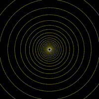
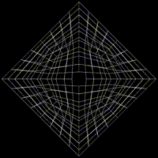
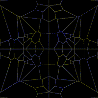
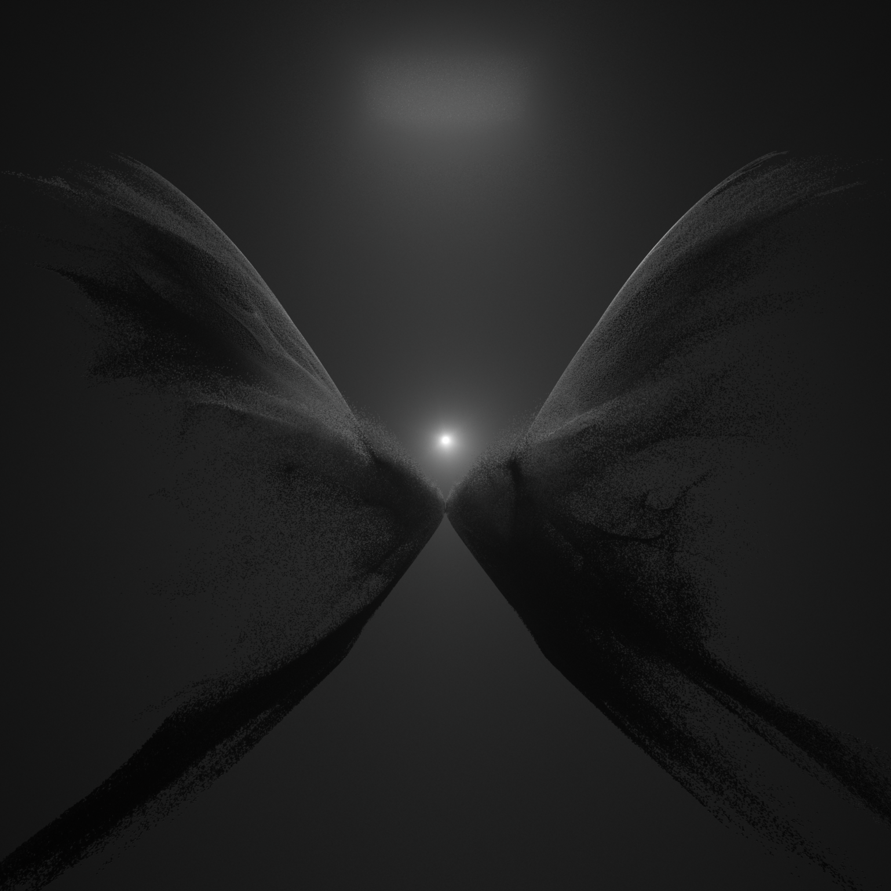
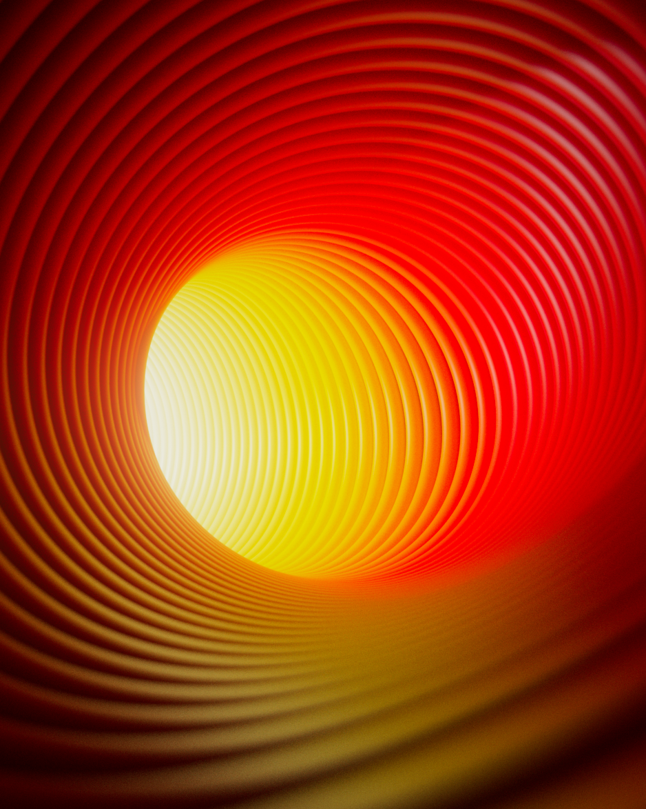
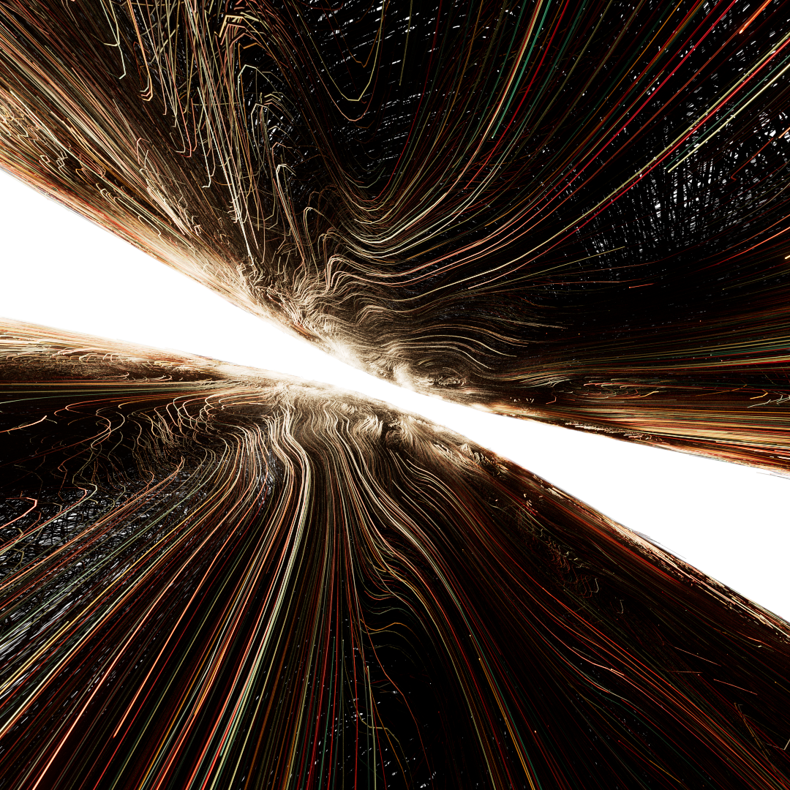

<h1> Hi there 👋 I am Nitzan Tregerman </h1>

I am a freelance motion graphics artist / designer. My main focus is mostly procedural generation, generative design and math.
I'm always keen to work with new people and collaborate on good projects so don't be shy and say hi :)

you can check out my website at [nitzan-tregerman.com](https://www.nitzan-tregerman.com)

<h1> Community Projects </h1>

I share my personal projects for free with everyone. Feel free to open and explore them, grab what you like.
 

If you any question you are welcome to send me a message at nitzan.tregerman@gmail.com
 
 
 

<section>

  

  ## [Polar Trail](https://github.com/nitzan-treg/Polar_Trail.git)

  This is an experiment with curves and polar coordinates, I created the curves using a curl noise marching and then deformed it by using polar coordinates.

</section>

 
 
 
 
 

<section>

  

  ## [Polar Particles](https://github.com/nitzan-treg/2021_10_03_Fractal-Ornament)

  This is an experiment with particles and polar coordinates, I created a particle simulation that flows along the Y axis and then deformed it by using polar coordiantes.

</section>

 
 
 
 
 

<section>

  

  ## [loops_and_subdivisions I](https://github.com/nitzan-treg/2021_10_25_loops_and_subdivisions.git)
Using a Forloop with Feedback to recursively polyextrude a simple model in two dimention, Then animating the distance, twist and inesrt parameters of the polyextude node.

</section>

 
 
 
 

<section>

  

  ## [loops_and_subdivisions II](https://github.com/nitzan-treg/2021_10_26_loops_and_subdivisions_II.git)

Using a Forloop with Feedback to recursively polyextrude a simple model in three dimention, Then animating the distance, twist and inesrt parameters of the polyextude node.

</section>

 
 
 
 

<section>

  

  ## [Follow The Ball](https://github.com/nitzan-treg/2021_11_10_Follow-the-ball_II)

This is an experiment with camera rig and motion graphics, I tried to create an interesting animation by animating a camera along a curve while changing the enviroment drastically.

</section>

 
 
 
 

<section>

  

  ## [Purple Mountain](https://github.com/nitzan-treg/2021_10_28_Purple_Mountain)

  By generating noise from the length of the Position vector, and then settings time to offset the noise will result in "pushing" away the noise from the origin. 
  
  The result by default is quiet interesting right of the bat, in order to break the shape I layered noises on top of each other

</section>

 
 

<section>

  

  ## [Davidope I](https://github.com/nitzan-treg/2021_10_08_dvdp_I)

It is an expiriment on stacking animation of rotation matrices together. the rotation amplitude is determined by the distance of the points from the origin.

Stacking different rotation matricies together results in a contrast of speed which turns out as an interesting animation.

</section>

 
 

<section>

  

  ## [Davidope_II](https://github.com/nitzan-treg/2021_10_09_dvdp_II.git)

  An attempt to create a satisfying looping animation in the black & white style of davidope I used a falloff and a rotation matrix to control the animation

</section>

 
 
 
 
 

<section>

  

  ## [Davidope_III](https://github.com/nitzan-treg/2021_10_12_dvdp_III.git)

  It's an experiment, what happens when you rotate a position vector after you convert it to polar coordinates? obviously, it doesn't make a lot of sense, but the results are beautiful.

</section>

 
 
 
 
 

<section>

  

  ## [Davidope_IV](https://github.com/nitzan-treg/2021_10_13_dvdp_IV.git)
  The setup transforms points in a circular pattern, projects them on the XY plane and then uses them to create Voronoi patterns
  
  The resulting voronoi parrtened is clipped and mirrored along the X and Z Axis's

</section>

 
 
 

<section>

  

  ## [Polar_Wings](https://github.com/nitzan-treg/2021_10_15_Polar_Wings.git)

  Created in collaboration with Roy Rosen

  A particle simulation that is deformed with polar coordiantes and mirrored to give the shape of wings
  

</section>

 
 
 
 

<section>

  

  ## [Strange Attractor](https://github.com/nitzan-treg/2021_10_04_Strange_Attactor.git)
  Solving a system of ordinary differential equations that is also chaotic (deterministic chaos) results in a unique model that is very interesting to explore.

  Alternative equations to explore might be the lorenz equation or other strange attractors.

</section>

 
 
 

<section>

  

  ## [Silver Flower](https://github.com/nitzan-treg/2021_11_11_silver_flower.git)

  In this project I tried to create a procedural feather, furethermore (pun intended) I wanted to do it all in vex without any grooming tools.

</section>

 
 
 
 
 

<section>

  

  ## [Blue Spiral](https://github.com/nitzan-treg/2021_10_05_Blue_Spiral.git)

 This render is an attempt to recreate the beautiful art of Toros Kose

  My approach was to create multiple curves by copying a line to a curve. looking back at it, I it would have been easier with a "sweep" node. Rendered the geometry as curves using Redshift

</section>

 
 
 

<section>

  

  ## [The Red Box](https://github.com/nitzan-treg/2021_10_20_The_Red_Box.git)

 This is one of the simplest setups I made for the Daily challange, Never the less, the result is pretty interesting The idea behind this picture is play with the composition of the image, and specifically with the "Rule of thirds" to create a beatiful picture.

</section>

 
 
 

<section>

  

  ## [Worm Hole](https://github.com/nitzan-treg/2021_10_18_wormhole.git)

  The idea beheond this picture is to drive the composition toward the "hallway". the setup its pretty basic, a curve with toruses copied to its points, using the normals to orient the toruses

</section>

 
 
 
 
 

<section>

  

  ## [Reaction_Diffusion](https://github.com/nitzan-treg/2021_10_06_Reaction_Diffusion.git)

  A Reaction Diffusion simulation where the base model is a torus. the camera is located inside the torus which gives a nice feel of depth

</section>

 
 
 
 
 

<section>

  

  ## [Curl_noise_flow](https://github.com/nitzan-treg/2021_10_01_Curl_noise_flow.git)
  Using a curl noise to then generate vector field, which is then ray marched to genertail a trail that will define that follows the curl noise shape. trails are then rendred as wires. 

</section>

 
 
 
 
 
 

<section>

  

  ## [Fractal Ornament](https://github.com/nitzan-treg/2021_10_03_Fractal-Ornament)

  Recuresively coping a box to all its points resutls in an interesting structure. the boxes are scaled down and rotated in every iteration

  The scene is lit from a single light above the model with high GI bounces count.

</section>

 
 
 

<section>

  

  ## [Differential Line Growth](https://github.com/nitzan-treg/2021_11_14_Differential_Line_Growth_II.git)

  recursively subdividing and relaxin wires results in an interesting structure.

  after settings the base model, I added a shpere in the middle and set it to be fully reflective, resulting in an interesting projection of the scene on the sphere.

</section>
