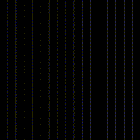

# Hi there 👋 I am Nitzan Tregerman

I am a freelance motion graphics artist / designer. My main focus is mostly procedural generation, generative design and math.
I'm always keen to work with new people and collaborate on good projects so don't be shy and say hi :)

you can check out my website at [nitzan-tregerman.com](https://www.nitzan-tregerman.com)

# Community Projects

I share my personal projects for free with everyone. Feel free to open and explore them, grab what you like.
‍ 

If you any question you are welcome to send me a message at nitzan.tregerman@gmail.com

  

  ## [Polar Trail](https://github.com/nitzan-treg/Polar_Trail.git)

  This is an experiment with curves and polar coordinates, I tried to create an interesting animation by animating the U, V, or Radius components of the Polar Coordinates

 
 
 
 
 
 
 
 
 

  

  ## [Polar Particles](https://github.com/nitzan-treg/2021_10_03_Fractal-Ornament)

  This is an experiment with particles and polar coordinates, I tried to create an interesting animation by animating the U, V or Radius compounents of the Polar Coordinates

 
 
 
 
 
 
 
 
 

 

  

  ## [loops_and_subdivisions I](https://github.com/nitzan-treg/2021_10_25_loops_and_subdivisions.git)

  This project is based on Entagma's tutorial: https://entagma.com/loops-subdivisions/ the tutorial teachs how to recursively subdivide and deform geometry.

 
 
 
 
 
 
 
 
 

  

  ## [loops_and_subdivisions II](https://github.com/nitzan-treg/2021_10_26_loops_and_subdivisions_II.git)

  This project is based on Entagma's tutorial: https://entagma.com/loops-subdivisions/ the tutorial teachs how to recursively subdivide and deform geometry.

 
 
 
 
 
 
 
 
 

  

  ## [Follow The Ball](https://github.com/nitzan-treg/2021_11_10_Follow-the-ball_II)

  This is the code you need to align images to the left:

 
 
 
 
 
 
 
 
 

  

  ## [Purple Mountain](https://github.com/nitzan-treg/2021_10_28_Purple_Mountain)

  This is the code you need to align images to the left:

 
 
 
 
 
 
 
 
 

  

  ## [Davidope I](https://github.com/nitzan-treg/2021_10_08_dvdp_I)

  This is the code you need to align images to the left:

 
 
 
 
 
 
 
 
 

  

  ## [Davidope_II](https://github.com/nitzan-treg/2021_10_09_dvdp_II.git)

  This is the code you need to align images to the left:

 
 
 
 
 
 
 
 
 

  

  ## [Davidope_III](https://github.com/nitzan-treg/2021_10_12_dvdp_III.git)

  This is the code you need to align images to the left:

 
 
 
 
 
 
 
 
 

  

  ## [Davidope_IV](https://github.com/nitzan-treg/2021_10_13_dvdp_IV.git)

  This is the code you need to align images to the left:

 
 
 
 
 
 
 
 
 

  

  ## [Polar_Wings](https://github.com/nitzan-treg/2021_10_15_Polar_Wings.git)

  This is an experiment with particles simulation and polar coordinates, what happens when you use convert only the "U" and "radius" dimensions to polar and feed it to the position attribute?

 
 
 
 
 
 
 
 

  

  ## [Strange Attractor](https://github.com/nitzan-treg/2021_10_17_Polar_Particles.git)

  This is the code you need to align images to the left:

 
 
 
 
 
 
 
 
 

  

  ## [Silver Flower](https://github.com/nitzan-treg/2021_11_11_silver_flower.git)

  This is the code you need to align images to the left:

 
 
 
 
 
 
 
 
 

  

  ## [Blue Spiral](https://github.com/nitzan-treg/2021_10_05_Blue_Spiral.git)

  This is the code you need to align images to the left:

 
 
 
 
 
 
 
 
 

  

  ## [The Red Box](https://github.com/nitzan-treg/2021_10_20_The_Red_Box.git)

  This is the code you need to align images to the left:

 
 
 
 
 
 
 
 
 

  

  ## [Worm Hole](https://github.com/nitzan-treg/2021_10_18_wormhole.git)

  This is the code you need to align images to the left:

 
 
 
 
 
 
 
 
 

  

  ## [Reaction_Diffusion](https://github.com/nitzan-treg/2021_10_06_Reaction_Diffusion.git)

  This is the code you need to align images to the left:

 
 
 
 
 
 
 
 
 

  

  ## [Curl_noise_flow](https://github.com/nitzan-treg/2021_10_01_Curl_noise_flow.git)

  This is the code you need to align images to the left:

 
 
 
 
 
 
 
 
 

  

  ## [Fractal Ornament](https://github.com/nitzan-treg/2021_10_03_Fractal-Ornament)

  This is the code you need to align images to the left:

 
 
 
 
 
 
 
 
 

  

  ## [Differential Line Growth](https://github.com/nitzan-treg/2021_11_14_Differential_Line_Growth_II.git)

  This is the code you need to align images to the left:

 
 
 
 
 
 
 
 
 
